# 현황 위젯 기능

위젯 추가, 제거

## 시간추적
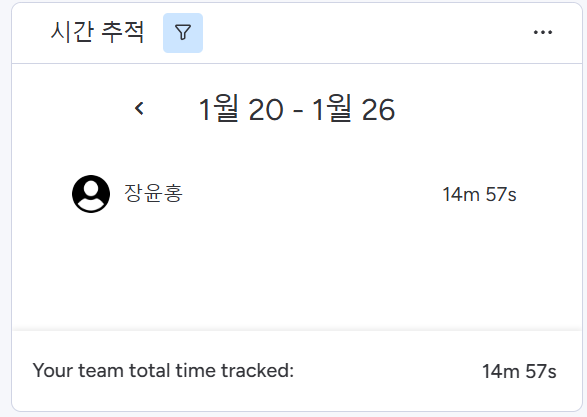

작업자 태스크 작업 시간 표시

## 차트
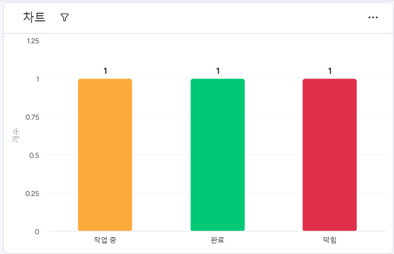
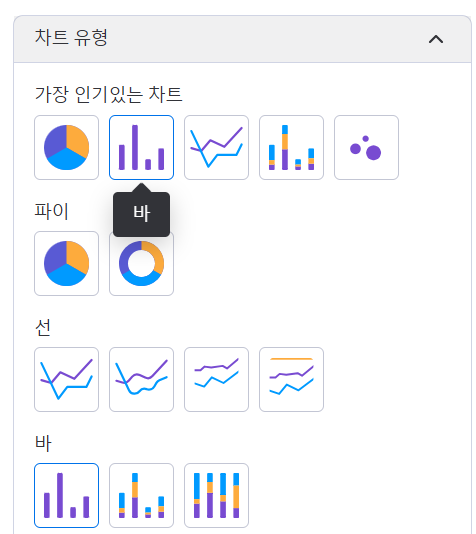

태스크 작업 현황 차트로 보여주기

차트 유형별 제공

x, y 설정정

## 캘린더
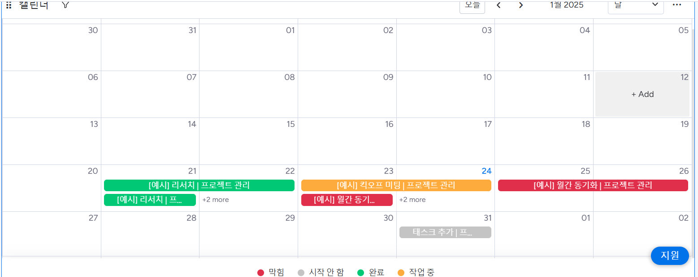

## 간트
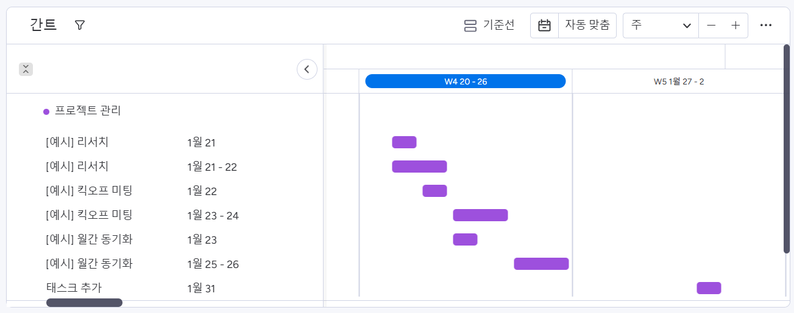

## 타임라인
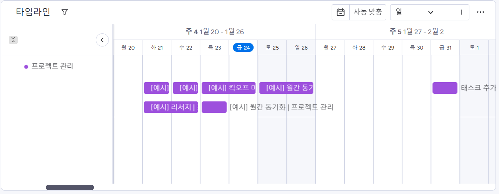

## 업데이트 피드
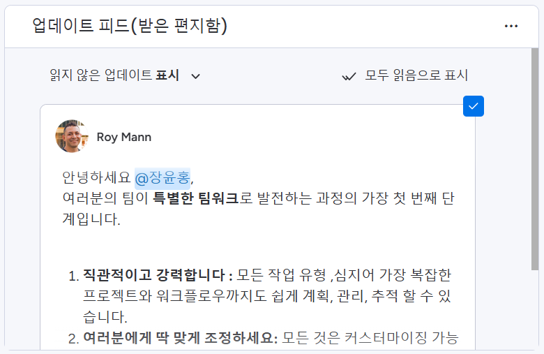

## 프로젝트 진행상황
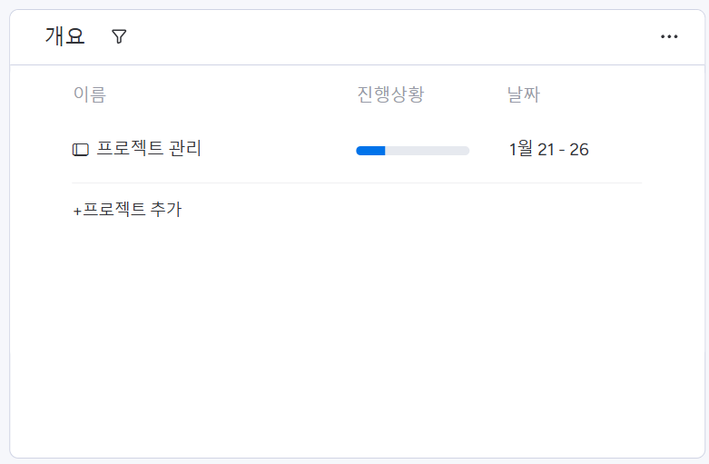

## 파일 갤러리
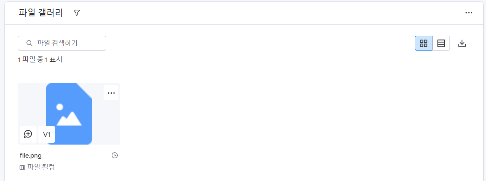
문서 공유 가능

## 상태 카드
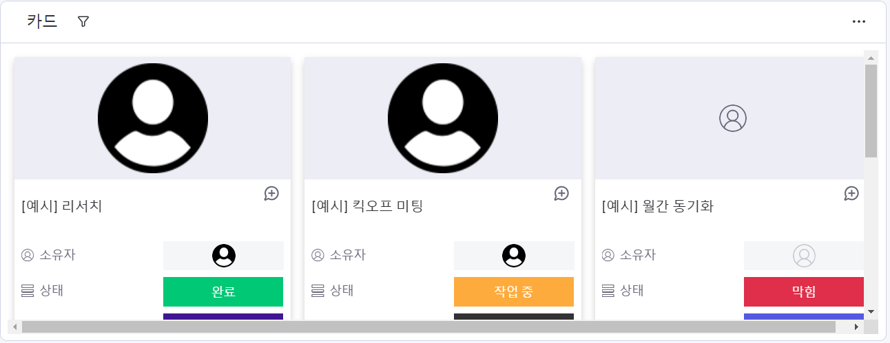

## 카운트다운
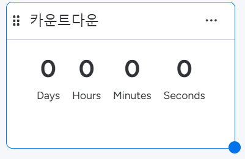

# 필터기능
