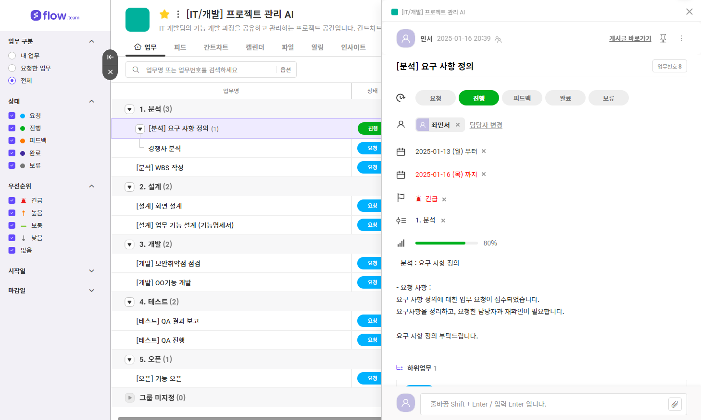

# 개발 프로젝트 WBS 관리 사이트

## 목적

기존 관련 툴들이 WBS 기능에만 집중되어 주로 비즈니스 용도로 사용되고 있는 상황

커뮤니티 기능을 추가하여 프로젝트 구인을 쉽게 하고, 사용 대상을 기업에서 개인 사용자로 확장하고자 함.

## 기존 사이트 장단점 분석

### 플로우

장점

- 템플릿 지원으로 인한 쉬운 프로젝트 관리

- 반복 업무 자동 등록
- 메신저 기능 지원으로 인한 업무와 사생활 분리 가능

단점

- 본격적인 프로젝트 관리를 위한 요금제 결제 필요(인사이트, 간트 차트, OKR 등)
- 일정에 대한 세부 필터 필요 (필터 예시: 회의, 프로젝트 마감일 등)

- 메신저 내용 분석을 통한 일정 추가 기능 없음

---------------------------------

### 지라

장점

- 백로그 관리 

- 타임라인, 캘린더 기능 제공

- 보고서를 생성하여 시각화 기능 지원

-

단점

- 단조로운 디자인 (가시성 떨어짐)

- 기능 익히기 전에는 사용 방법이 다소 복잡
- 한국어 번역 생소 (백로그, 커밋 등 음차번역)

-----------------------------------------------
### 먼데이닷컴

장점

- 작업상태, 우선순위 작업을 색상별로 표시(가시성 우수)

- 시간 추적 기능 존재해 태스크 경과 시간을 알 수 있음

- 커스텀 자동화 도구를 이용하여 작업 효율 증대

- 작업 이력 필터로 추적 가능

단점

- 메신저 기능 불편
- 태스크 일정 시간 초과 작업시 알림 설정이 없음
- 기능 사용에 대한 안내가 플랫폼 내에 없고 외부 사이트로 안내

## 홀라

장점

- 오직 프로젝트, 스터디 팀원 모집 기능만 있기 때문에 화면에 불필요 UI 없음

- 필터 기능으로 원하는 기술 스택 사용 프로젝트 찾기 가능능

단점

- 그 외 부가기능 전무

- 마감이 되지 않은 글 중 몇명이 구인 되었는지 확인 할 수 있는 방법 부재

## AI 적용은 개발 진행하면서 애자일하게 추가하겠습니다.