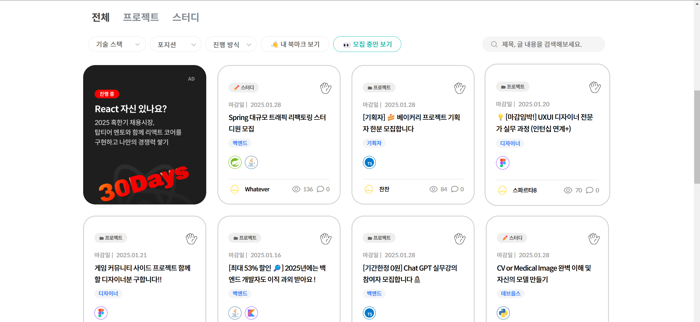

# 개발 프로젝트 WBS 관리 사이트

 

## 팀소개

 

<li> <b>팀장</b>: 장윤홍</li>
 
<li> <b>팀원</b>: 김민혜, 좌민서, 홍승표</li>

 

## 목적

 

기존 관련 툴들이 WBS 기능에만 집중되어 주로 비즈니스 용도로 사용되고 있는 상황

커뮤니티 기능을 추가하여 프로젝트 구인을 쉽게 하고, 사용 대상을 기업에서 개인 사용자로 확장하고자 함.

 

## 기존 사이트 장단점 분석

### 플로우

<!--  -->

 

#### <li> 장점 </li>

 

1. 템플릿 지원으로 인한 쉬운 프로젝트 관리

&nbsp; 
<!--  -->

 

2. 반복 업무 자동 등록

 

3. 메신저 기능 지원으로 인한 업무와 사생활 분리 가능

&nbsp; 
<!--  -->

 
 

#### <li> 단점 </li>

 

1. 본격적인 프로젝트 관리를 위한 요금제 결제 필요(인사이트, 간트 차트, OKR 등)

 

2. 일정에 대한 세부 필터 필요 (필터 예시: 회의, 프로젝트 마감일 등)

&nbsp; 
<!--  -->

 

3. 메신저 내용 분석을 통한 일정 추가 기능 필요

 
 

---------------------------------

### 지라

<!--  -->

 

#### <li> 장점 </li>

 

1. 백로그 관리 

&nbsp; 
<!--  -->

 

2. 타임라인, 캘린더 기능 제공

&nbsp; 
<!--  -->

 

3. 보고서를 생성하여 시각화 기능 지원

&nbsp; 
<!--  -->

 
 

#### <li> 단점 </li>

 

1. 단조로운 디자인 (가시성 떨어짐)

&nbsp; 
<!--  -->

 

2. 기능 익히기 전에는 사용 방법이 다소 복잡

 

3. 한국어 번역 생소 (백로그, 커밋 등 음차번역)

 
 

-----------------------------------------------

### 먼데이닷컴

<!--  -->

 

#### <li> 장점 </li>

 

1. 작업상태, 우선순위 작업을 색상별로 표시(가시성 우수)

&nbsp; 
<!--  -->

 

2. 시간 추적 기능 존재해 태스크 경과 시간을 알 수 있음

&nbsp; 
<!--  -->

 

3. 커스텀 자동화 도구를 이용하여 작업 효율 증대

&nbsp; 
<!--  -->

 

4. 작업 이력 필터로 추적 가능

&nbsp; 
<!--  -->

 
 

#### <li> 단점 </li>

 

1. 메신저 기능 불편

 

2. 태스크 일정 시간 초과 작업시 알림 설정이 없음

 

3. 기능 사용에 대한 안내가 플랫폼 내에 없고 외부 사이트로 안내

&nbsp; 
<!--  -->

 
 

-----------------------------------------------

### 홀라

&nbsp; 
<!--  -->

 

#### <li> 장점 </li>

 

1. 오직 프로젝트, 스터디 팀원 모집 기능만 있기 때문에 화면에 불필요 UI 없음

&nbsp; 
<!--  -->

 

2. 필터 기능으로 원하는 기술 스택 사용 프로젝트 찾기 가능능

 
 

#### <li> 단점 </li>

 

1. 그 외 부가기능 전무

 

2. 마감이 되지 않은 글 중 몇명이 구인 되었는지 확인 할 수 있는 방법 부재

 
 

## 서비스 구현 계획

 

<li> <b>주기능</b>: 프로젝트 관리 서비스 </li>
 
<li> <b>부가기능</b>: 프로젝트 팀원 모집 기능 </li>

 

### 기존 서비스 장점 반영

 

1. 쉬운 프로젝트 관리
 

2. 반복 업무 자동화
 

3. 메신저 기능
 

4. 작업 상태 시각화
 
 

### 기존 서비스 단점 보완

 

1. 세부 일정 필터 기능 추가
 

2. 메신저 내용 분석
 

3. 태스크 작업 초과 시간 알림
 

4. 음차 번역이 아닌 한국어
 

 

## AI 관련 서비스 적용은 개발하면서 애자일하게 추가하겠습니다.
